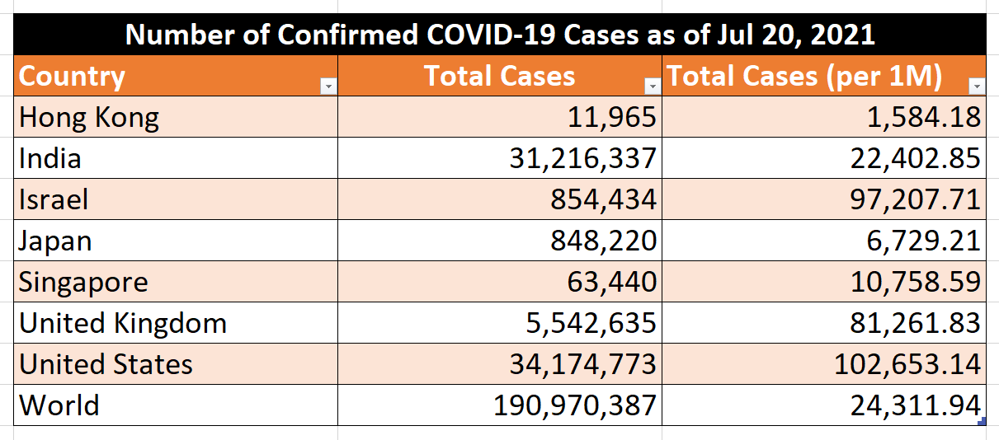
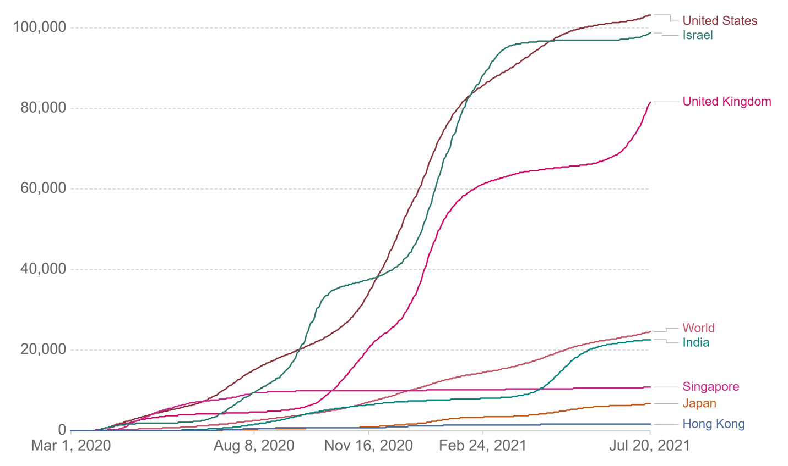
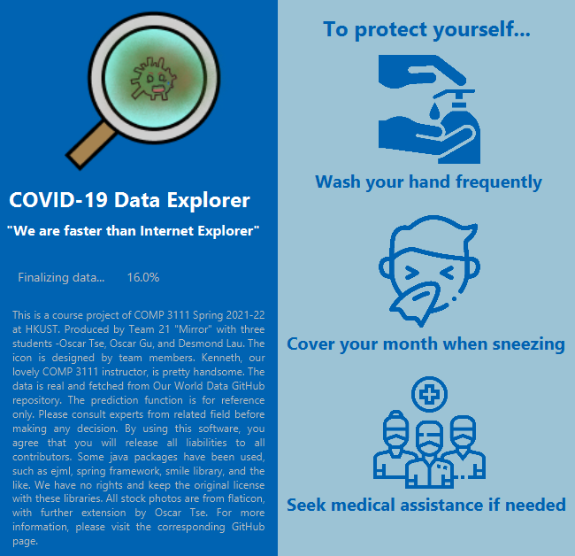
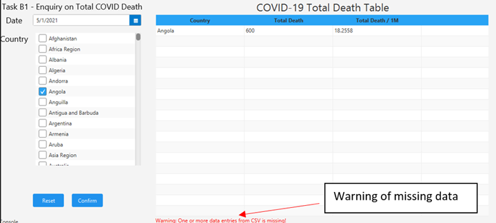
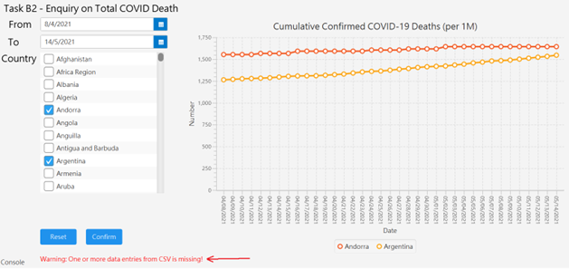
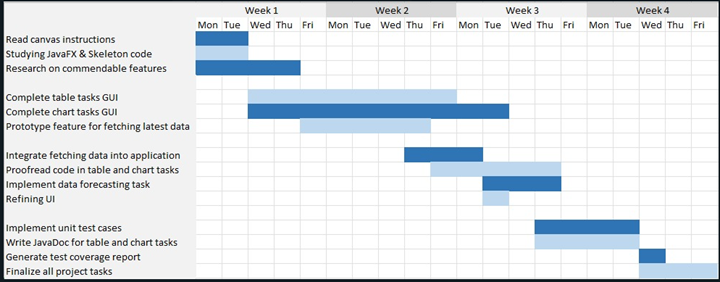
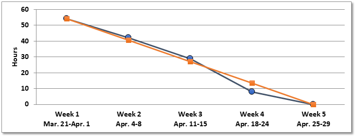

# DeCVOID -- COMP 3111 Project

## Disclaimer
This software is a project from HKUST COMP 3111 in Spring 2021-2022. Even though the software will retrieve real COVID data from the Internet, the software itself is only for assesssment and demo only. You shoukd NOT use this software to be one of the evidence of performing decisions, or treat it as a reference. If you have any doubts, please visit your respective government website regarding to COVID-19. We do not intend to give any medical advise in this project. **By continuing browsing this repositary and performing corresponding actions (such as downloading the software and the like), you agree that you understand the above statement and will release all liabilities to all contributors.**


## Introduction

### TL;DR
This is a team project in COMP 3111 HKUST. The project goal is to make a COVID-19 Visualizer utilizing Java, JavaFX, and other software engineering techniques.

The following is the official project description and requirements.

### Project description
The objective of the team project is to explore ways in developing innovative applications and services with the utilization of public sector information. In addition to the programming skills with Java, core skills to be acquired and demonstrated include collaborative problem solving, user experience design, data visualization, and data mining.

In this project, you are provided with a dataset of information associated with COVID-19 collected from different countries over the period from Mar 1, 2020 to July 20, 2021. Your team is going to develop a Java program to visualize and analyze the dataset with a series of specific tables and charts. Required features are specified in the description of the respective tasks.

All students will be grouped into teams of 3 members, where each member will be responsible for the generation of specific tables and charts to address topics of concern (chosen from A, B, or C exclusively):

- Table A: Confirmed COVID-19 Cases 
- Chart A: Confirmed COVID-19 Cases 
- Table B: Confirmed COVID-19 Deaths 
- Chart B: Confirmed COVID-19 Deaths 
- Table C: Rate of Vaccination against COVID-19
- Chart C: Rate of Vaccination against COVID-19
  
The team is also provided with a skeleton codebase to kick-start this project. It is totally up to the team to decide on whether to build on the codebase for further development or to start their original development from scratch. 

The teaching team provides the skeleton code, which will include comments like `Skeleton Code here` to clarify.
### Task Description
There are six tasks for each team, including three table tasks and three chart tasks.

- Task A1 (Table): Confirmed COVID-19 Case
- Task A2 (Chart): Confirmed COVID-19 Case
- Task B1 (Table): Confirmed COVID-19 Deaths
- Task B2 (Chart): Confirmed COVID-19 Deaths
- Task C1 (Table): Rate of Vaccination against COVID-19
- Task C2 (Chart): Rate of Vaccination against COVID-19
- Commendable features out of the above description

The requirements of A/B/C is the same except the object is different. We take Task A1/A2 as an example:


##### Task A1:
Generate data tables showing the number of confirmed COVID-19 cases by country

Input

- Specify the date of interest
- Specify the countries of interest
[sample input]
    - Date of Interest: "Jul 20, 2021"
    - Countries of Interest:
  
    

Output

- Label the data table with a proper title: "Number of Confirmed COVID-19 Cases as of [Date of Interest]"
- Present data in 3 columns with proper headings of "Country", "Total Cases", and "Total Cases (per 1M)"
- Present data for the countries of interest in rows
    - [Sample Output] **(The data is this example is not real)**
      

##### Task A2:
Generate data charts showing the cumulative confirmed COVID-19 cases (per 1M) by country

Input

- Specify the period of interest
- Specify the countries of interest
[sample input]
    - Period of Interest: "from Mar 1, 2020 to Jul 20, 2021"
    - Countries of Interest:
     
      
Output

- Label the data chart with a proper title: "Cumulative Confirmed COVID-19 Cases (per 1M)"
- Label the x-axis and y-axis with proper scales
- Present data in coloured cumulative curves labelled with corresponding countries
    - [sample output] **(The data in this example may not be real)**
      
    
### Task Distribution
- COMP 3111 Teaching Team: Project Description, Project requirements, task description and skeleton code
- Oscar TSE, Ngo Chun: Task A1, B1, C1, startup screen and GUI enhancement
- Oscar GU, Tin Lok: Task A2, B2, C2
- Desmond LAU, Cheuk Hei: Real Time data download, GUI Enhancement, Data-mining and time series analysis

### Contact of respective authors
COMP 3111 Teaching Team:
- Professor. LEUNG, Wai Ting Kenneth (Email: [kwtleung@ust.hk](mailto:kwtleung@ust.hk))
- TA. CHAN, Namkiu (Email: [namkiu@ust.hk](mailto:namkiu@ust.hk))
- TA. CHIU, Hungchun (Email: [hchiuab@connect.ust.hk](mailto:hchiuab@connect.ust.hk))
- TA. MA, Haoyang (Email: [hmaaj@connect.ust.hk](mailto:hmaaj@connect.ust.hk))
- TA. ZHAO, Yukun (Email: [yzhaoeg@connect.ust.hk](mailto:yzhaoeg@connect.ust.hk))

Students:
- Oscar TSE, Ngo Chun (Email: [nctse@connect.ust.hk](mailto:nctse@connect.ust.hk))
- Oscar GU, Tin Lok (Email: [ltgu@connect.ust.hk](mailto:ltgu@connect.ust.hk))
- Desmond LAU, Cheuk Hei (Email: [chdlau@connect.ust.hk](mailto:chdlau@connect.ust.hk))

## Project Deliveries

### Screenshots of the Program
Starting screen


Demo Screen


### Gannt Chart

### Burndown Chart

### Javadoc
The corresponding Javadoc can be viewed at [here](https://oscar-0713.github.io/comp3111-21s-t21-deCOVID/)


### Download
To use this software, simply run the following commands:
```bash
git clone
gradle run
```
Note: It requires related JDK installed in the targeted PC. Please install JDK before running the above commands.

## Reference
### Libararies

We have included the following libraries to our project:

- Apache Common CSV [Library Website](https://commons.apache.org/proper/commons-csv/)
- AssertJ [Library Website](https://joel-costigliola.github.io/assertj/)
- Efficient Java Matrix Library (EJML) [Library Website](http://ejml.org/wiki/index.php?title=Main_Page)
- Gson [Library Website](https://github.com/google/gson)
- Guava: Google Core Libraries for Java [Library Website](https://github.com/google/guava)
- Jackson Databind [Library Website](https://github.com/FasterXML/jackson-databind)
- Java Time Series [Library Website](https://github.com/signaflo/java-timeseries)
- Simple Logging Facade for Java (SLF4J) [Library Website](https://www.slf4j.org/)
- Smile: Statistical Machine Intelligence and Learning Engine [Library Website](https://haifengl.github.io/index.html)
- Spring [Library Website](https://spring.io/)
- TestFX framework [Library Website](https://github.com/TestFX/TestFX)


We have also extended the following libraries by source code:
- CountryCode / nv-i18n [Library Website (Country Code **Deprecated**)](https://github.com/TakahikoKawasaki/CountryCode) [Library Website (nv-i18n)](https://github.com/TakahikoKawasaki/nv-i18n)

### GUI Resources
Some icons are from Flaticon and extended / edited by our team
